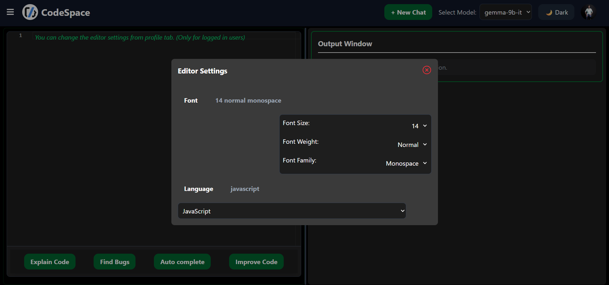

# 🌐 CodeSpace – Frontend

**CodeSpace** is a full stack **MERN based AI code assistant web application**, mainly designed to reduce the prompt time of developers when they paste their code on various AI models like ChatGPT, deepSeek, Gemini etc.

Whether you want to understand, debug, complete, or improve your code — CodeSpace does it all with just one click.

---

## ✨ Key Highlights

- 🔐 Google OAuth Authentication

- ⚡️ One-click AI Actions:
- - Code Explanation
- - Bug Fixing
- - Auto Completion
- - Code Improvement

- 💡 Multiple AI Model Support (switch between models)

- 💾 Prompt History Tracking (chat saving)

- 🌓 Dark/Light Theme Toggle

- 🎯 Personalized Editor Settings

---

## 🖼️ User Experience

CodeSpace offers a modern and minimal interface with a smooth user flow:

- Paste your code → Choose an action → Get instant AI suggestions

- Effortless navigation with responsive design

- Seamless authentication and real-time processing

---

## 🚀 Features

- 🔐 Google OAuth	          Fast and secure login using Google
- 🧠 AI Integration	          Supports OpenAI models via Groq API (super-fast inference layer)
- 💬 Code Analysis	          Get code explanation, logic understanding, or suggestions instantly
- 🐞 Bug Detection & Fixing	  Detect common bugs and get AI-generated fixes
- 🔧 Auto Completion	      Complete partial or unfinished code snippets smartly
- ✨ Code Improvement	     Optimize and enhance code formatting, logic, and syntax
- 🌙 Theme Toggle	          Switch between dark and light modes based on your preference
- 🧾 Prompt History	          Save and revisit previous prompts and AI responses
- ⚙️ Editor Customization	  Font size, themes, language settings for comfortable coding
- 🖌️ Tailwind Styling	       Responsive and scrollable design built with Tailwind CSS

---

## 🛠 Tech Stack

- Frontend: 	React.js, React Router DOM, Tailwind CSS, Axios
- Auth:     	Google OAuth
- AI Layer: 	Groq + OpenAI APIs (via custom backend integration)
- Dev Tools:	Vite, ESLint
- Deployment:   Vercel (for frontend hosting)

---

## 🧩 Folder Stucture
```php
CodeSpace_Frontend/
├── public/                # Static assets
├── src/
│   ├── components/        # Reusable UI components (Editor, Navbar, etc.)
│   ├── pages/             # Route-level pages (Home, Login, Editor)
│   ├── contexts/          # Global state using React Context API
│   ├── services/          # Axios API configs
│   ├── hooks/             # Custom React hooks
│   ├── utils/             # Utility/helper functions
│   ├── App.jsx            # App-level routing & layout
│   └── main.jsx           # React entry point
└── tailwind.config.js     # Tailwind configuration

```

---

## 📸 Screenshots

### 🔐 Login Page


### 🏠 Home Feed


### 👤 Profile


### Chats


### Editor Settings


---

## 🔧 Installation & Setup

### 📦 Prerequisites

- Node.js and npm installed
- Backend (`CodeSpace_backend`) running
- Cloudinary API keys (set on backend)
- Google OAuth client credentials 

---


### 🚀 Run Locally

```bash
# Clone the repo
git clone https://github.com/omkhot/CodeSpace_Frontend.git
cd CodeSpace_Frontend

# Install dependencies
npm install

# Start the development server
npm run dev

```

### Environment Variables
-create the .env file with-
VITE_BACKEND_URL=your_backend_url

---

## Deployment:
- Deployed on Vercel
- Deployed Link: https://code-space-frontend-tau.vercel.app/


